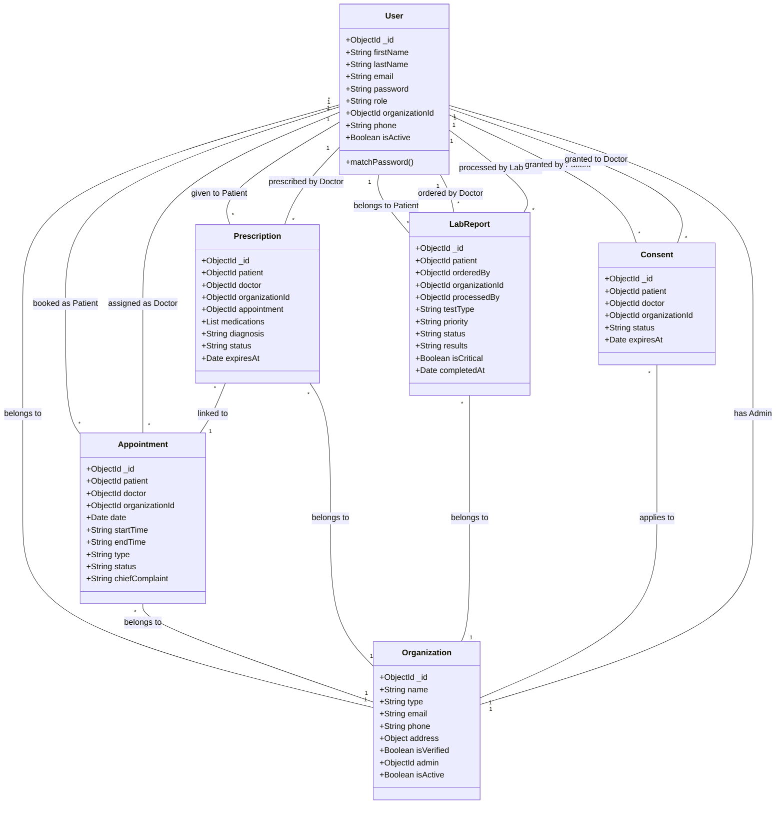

# WeaveHealth HIMS - UML Class Diagram

This document contains the UML Class Diagram representing the core Entity-Relationship model of the WeaveHealth HIMS backend database architecture.

## Description of Relationships

1. **User and Organization:** A user belongs to a specific organization (hospital/clinic), unless they are a Super Admin or a global Patient. An organization has exactly one Admin user.
2. **Appointments:** Connect a Patient (User) and a Doctor (User) within the context of a specific Organization.
3. **Prescriptions:** Issued by a Doctor to a Patient. It is often linked directly to an existing Appointment.
4. **Lab Reports:** Ordered by a Doctor for a Patient, and eventually processed by a Lab Technician (User). Always scoped to an Organization.
5. **Consent:** Represents data privacy and sharing agreements, where a Patient grants access to their medical records to a specific Doctor or Organization.
